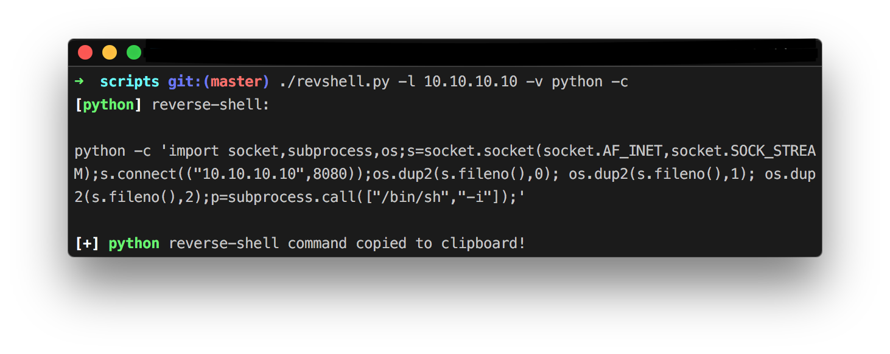
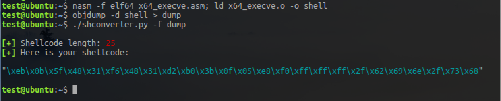
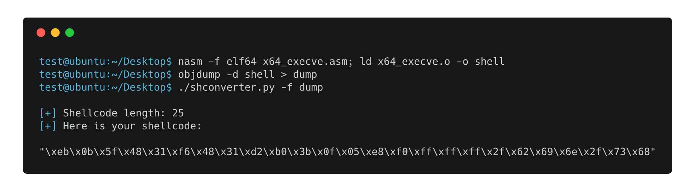
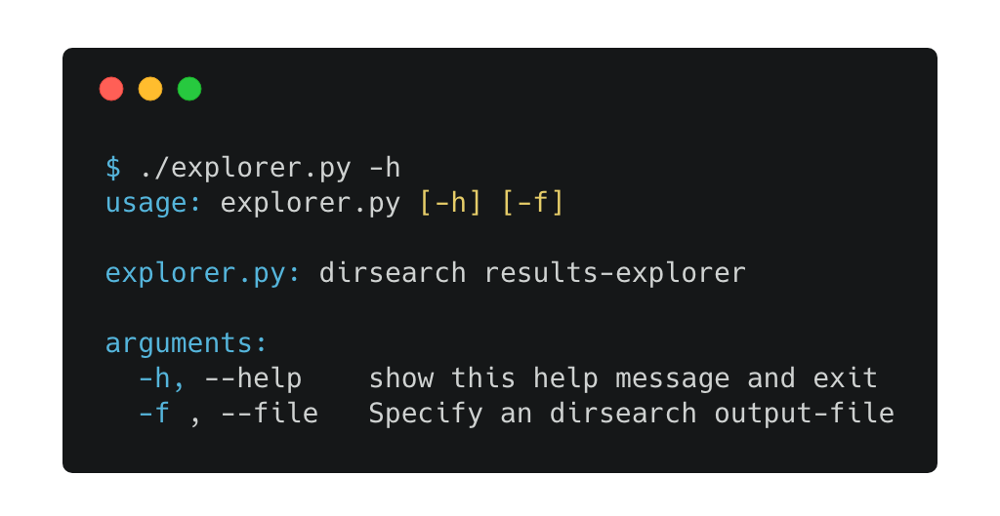
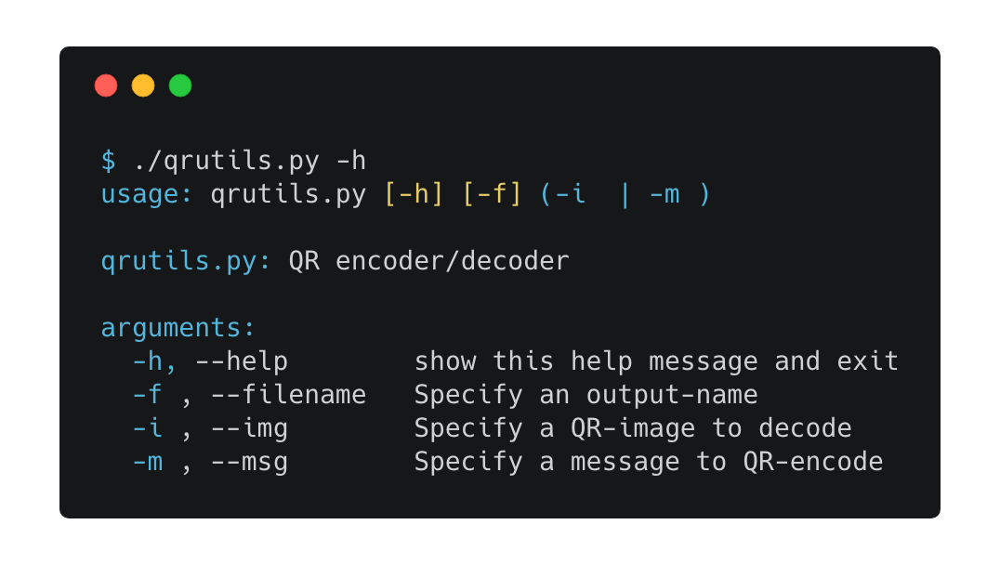
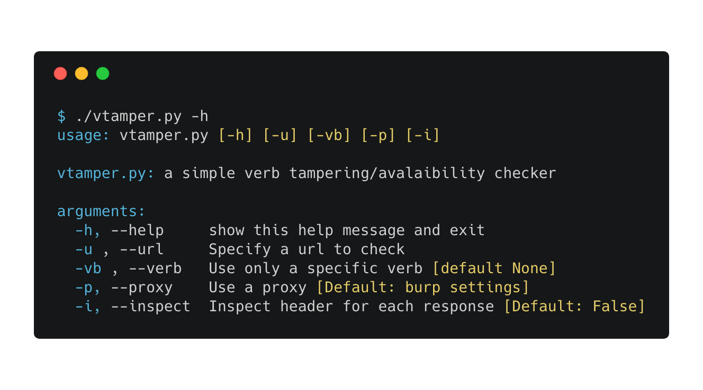
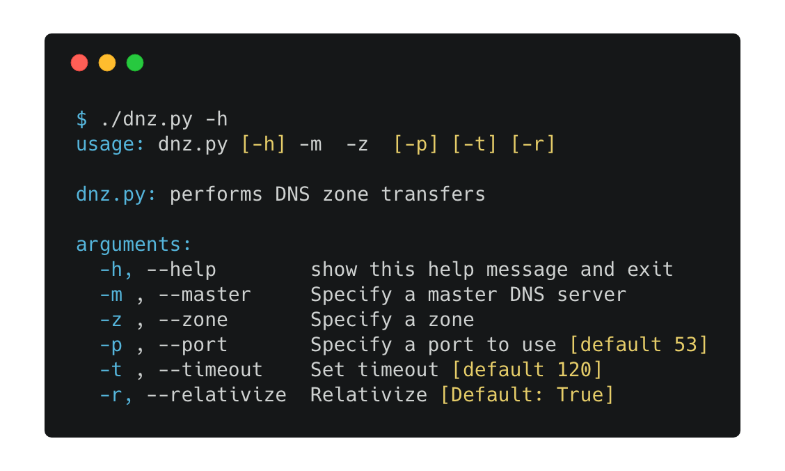

# pypentesting  

This repository contains some python tools that may be of some help in pentesting, CTFs or information security assignments in general:

*   [revshell.py](#revshell) (_reverse shell generator_)
*   [shconverter.py](#shconverter) (_objdump2shellcode converter_)
*   [explorer.py](#explorer) (_processes [dirsearch](https://github.com/maurosoria/dirsearch) results and then pops a browser with every url we can visit_)
*   [qrutils.py](#qrutils) (_easily decode/encode QR codes_)
*   [vtamper.py](#vtamper) (_verb tampering/avalaibility checker_)
*   [dnz.py](#dnz) (_dns zone transfers_)
*   [irc_bot.py](#irc) (_an IRC bot main template using twisted framework_)
*   [fakeid.py](#fakeid) (_fake id generator_)

## revshell

This is a simple script to automate the process of generating a reverse-shell command like those described in [pentestmonkey](http://pentestmonkey.net/cheat-sheet/shells/reverse-shell-cheat-sheet) blog:

__Note:__ You can find a more updated and featured version of the `revshell.py` script [__here__](https://github.com/chrispetrou/shellback)!

## shconverter

This is a small script that takes as input an objdump output and extracts the shellcode:

Example - asm snippet from [here](https://github.com/chrispetrou/asm-snippets/blob/master/x64_execve.asm):

## explorer

This script uses [`selenium`](https://selenium-python.readthedocs.io/) with [chromedriver](https://sites.google.com/a/chromium.org/chromedriver/) (_can work with other web-drivers also_) to open every url (_with a status code of 200_) from a [`dirsearch`](https://github.com/maurosoria/dirsearch) output (_specified with --plain-text-report_):

## qrutils
Easily decode a QR code using [zxing online service](https://zxing.org/w/decode.jspx) or QR-encode a message using [qrencode](https://fukuchi.org/works/qrencode/) utility:

## vtamper

Simple verb avalaibility/tampering checker. Using the `-i` switch it checks also for common header-vulnerabilities:

## dnz
This script uses [`dnspython`](http://www.dnspython.org/) to perform DNS zone transfers easily:

## irc
This script can be used as a template to built an automated IRC-bot using [`twisted`](https://twistedmatrix.com/trac/) framework.

## fakeid
This script uses [fakenamegenerator.com](https://www.fakenamegenerator.com/) to generate a completely random person's id.

### Requirements:

**Note:** To install the requirements (except for [qrencode](https://fukuchi.org/works/qrencode/) and [chromedriver](https://sites.google.com/a/chromium.org/chromedriver/)):

`pip install -r requirements.txt --upgrade --user`

### Disclaimer
>These tools are only for testing and academic purposes and can only be used where strict consent has been given. Do not use them for illegal purposes! It is the end user’s responsibility to obey all applicable local, state and federal laws. Developers assume no liability and are not responsible for any misuse or damage caused by these tools, programs, scripts and software.

## License

This project is licensed under the GPLv3 License - see the [LICENSE](LICENSE) file for details